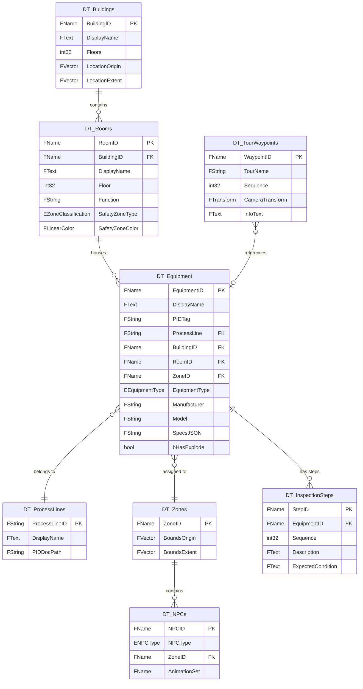
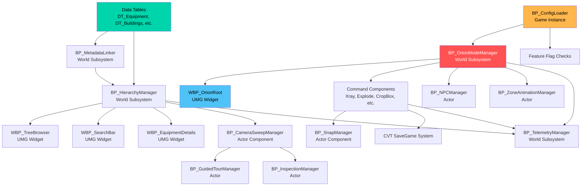

# Orion Studios — Backend Schema
**Version 1.0.0** · Orion Studios · 2026-05-31

---

## AI READING INSTRUCTION

Read `[SPEC]` sections for authoritative schema definitions (C++ structs, JSON formats).
Read `[NOTE]` sections for design rationale.

---

## 1. Enum Definitions

**[SPEC]**

```cpp
// OrionTypes.h
#pragma once
#include "CoreMinimal.h"
#include "OrionTypes.generated.h"

// ──────────────────────────────────────────────
// Mode System
// ──────────────────────────────────────────────

UENUM(BlueprintType)
enum class EOrionMode : uint8
{
    MODE_LAUNCHER    = 0  UMETA(DisplayName = "Launcher"),
    MODE_SHOWCASE    = 1  UMETA(DisplayName = "Showcase"),
    MODE_OPERATIONS  = 2  UMETA(DisplayName = "Operations"),
    MODE_TRAINING    = 3  UMETA(DisplayName = "Training (v2)")
};

UENUM(BlueprintType)
enum class EOrionRole : uint8
{
    ROLE_VIEWER   = 0  UMETA(DisplayName = "Viewer"),
    ROLE_ENGINEER = 1  UMETA(DisplayName = "Engineer"),
    ROLE_ADMIN    = 2  UMETA(DisplayName = "Admin")
};

// ──────────────────────────────────────────────
// Equipment & Zone Classification
// ──────────────────────────────────────────────

UENUM(BlueprintType)
enum class EEquipmentType : uint8
{
    Pump          UMETA(DisplayName = "Pump"),
    Vessel        UMETA(DisplayName = "Vessel"),
    Conveyor      UMETA(DisplayName = "Conveyor"),
    Mixer         UMETA(DisplayName = "Mixer"),
    Valve         UMETA(DisplayName = "Valve"),
    Instrument    UMETA(DisplayName = "Instrument"),
    HeatExchanger UMETA(DisplayName = "Heat Exchanger"),
    Tank          UMETA(DisplayName = "Tank"),
    Motor         UMETA(DisplayName = "Motor"),
    Compressor    UMETA(DisplayName = "Compressor"),
    Filter        UMETA(DisplayName = "Filter"),
    Pipe          UMETA(DisplayName = "Pipe"),
    Structure     UMETA(DisplayName = "Structure"),
    Electrical    UMETA(DisplayName = "Electrical"),
    Other         UMETA(DisplayName = "Other")
};

UENUM(BlueprintType)
enum class EZoneClassification : uint8
{
    General    UMETA(DisplayName = "General"),
    Clean      UMETA(DisplayName = "Clean Room"),
    Chemical   UMETA(DisplayName = "Chemical"),
    Electrical UMETA(DisplayName = "Electrical"),
    Confined   UMETA(DisplayName = "Confined Space"),
    Hazardous  UMETA(DisplayName = "Hazardous")
};

UENUM(BlueprintType)
enum class ENPCType : uint8
{
    AmbientWorker  UMETA(DisplayName = "Ambient Worker"),
    TourGuide      UMETA(DisplayName = "Tour Guide"),
    SecurityGuard  UMETA(DisplayName = "Security Guard")
};

UENUM(BlueprintType)
enum class EMaintenanceStatus : uint8
{
    OK       UMETA(DisplayName = "OK"),
    Due      UMETA(DisplayName = "Due"),
    Overdue  UMETA(DisplayName = "Overdue"),
    Unknown  UMETA(DisplayName = "Unknown")
};

UENUM(BlueprintType)
enum class EMatchConfidence : uint8
{
    Exact     UMETA(DisplayName = "Exact Match"),
    Contains  UMETA(DisplayName = "Contains Match"),
    Fuzzy     UMETA(DisplayName = "Fuzzy Match"),
    Unmatched UMETA(DisplayName = "Unmatched")
};

UENUM(BlueprintType)
enum class ESectionFillMode : uint8
{
    Solid         UMETA(DisplayName = "Solid Fill"),
    Hatching45    UMETA(DisplayName = "45° Hatching"),
    CrossHatching UMETA(DisplayName = "Cross Hatching"),
    ColorByType   UMETA(DisplayName = "Color by Equipment Type")
};

UENUM(BlueprintType)
enum class EMeasurementUnit : uint8
{
    Meters      UMETA(DisplayName = "Meters"),
    Feet        UMETA(DisplayName = "Feet"),
    Millimeters UMETA(DisplayName = "Millimeters")
};

UENUM(BlueprintType)
enum class ESnapType : uint8
{
    None         UMETA(DisplayName = "None"),
    Vertex       UMETA(DisplayName = "Vertex"),
    Edge         UMETA(DisplayName = "Edge"),
    Midpoint     UMETA(DisplayName = "Midpoint"),
    Center       UMETA(DisplayName = "Center"),
    Face         UMETA(DisplayName = "Face"),
    Intersection UMETA(DisplayName = "Intersection")
};

UENUM(BlueprintType)
enum class EAnnotationCategory : uint8
{
    General        UMETA(DisplayName = "General"),
    Safety         UMETA(DisplayName = "Safety"),
    Maintenance    UMETA(DisplayName = "Maintenance"),
    DesignReview   UMETA(DisplayName = "Design Review")
};

UENUM(BlueprintType)
enum class EOrionTreeCategory : uint8
{
    Building    UMETA(DisplayName = "Building"),
    Room        UMETA(DisplayName = "Room"),
    Equipment   UMETA(DisplayName = "Equipment"),
    Component   UMETA(DisplayName = "Component")
};

UENUM(BlueprintType)
enum class EOrionSweepSpeed : uint8
{
    Fast    UMETA(DisplayName = "Fast"),
    Medium  UMETA(DisplayName = "Medium"),
    Slow    UMETA(DisplayName = "Slow")
};
```

---

## 2. Data Table Row Structs

**[SPEC]**

### 2.1 FEquipmentTableRow — Master Equipment Table

```cpp
// EquipmentTableRow.h
#pragma once
#include "Engine/DataTable.h"
#include "OrionTypes.h"
#include "EquipmentTableRow.generated.h"

USTRUCT(BlueprintType)
struct ORION_API FEquipmentTableRow : public FTableRowBase
{
    GENERATED_BODY()

    // ── Identity ──
    UPROPERTY(EditAnywhere, BlueprintReadWrite, Category = "Identity")
    FName EquipmentID;  // Primary key — matches actor tag

    UPROPERTY(EditAnywhere, BlueprintReadWrite, Category = "Identity")
    FText DisplayName;  // Localized via String Table

    UPROPERTY(EditAnywhere, BlueprintReadWrite, Category = "Identity")
    FString PIDTag;  // P&ID tag (e.g., "P-101")

    UPROPERTY(EditAnywhere, BlueprintReadWrite, Category = "Identity")
    EEquipmentType EquipmentType = EEquipmentType::Other;

    // ── Hierarchy ──
    UPROPERTY(EditAnywhere, BlueprintReadWrite, Category = "Hierarchy")
    FString ProcessLine;  // FK → DT_ProcessLines.ProcessLineID

    UPROPERTY(EditAnywhere, BlueprintReadWrite, Category = "Hierarchy")
    FName BuildingID;  // FK → DT_Buildings.BuildingID

    UPROPERTY(EditAnywhere, BlueprintReadWrite, Category = "Hierarchy")
    FName RoomID;  // FK → DT_Rooms.RoomID

    UPROPERTY(EditAnywhere, BlueprintReadWrite, Category = "Hierarchy")
    FName ZoneID;  // FK → DT_Zones.ZoneID

    // ── Specs ──
    UPROPERTY(EditAnywhere, BlueprintReadWrite, Category = "Specs")
    FString Manufacturer;

    UPROPERTY(EditAnywhere, BlueprintReadWrite, Category = "Specs")
    FString Model;

    UPROPERTY(EditAnywhere, BlueprintReadWrite, Category = "Specs")
    FString SpecsJSON;  // JSON blob: {"capacity_kg": 500, "pressure_bar": 10}

    // ── Content References ──
    UPROPERTY(EditAnywhere, BlueprintReadWrite, Category = "Content")
    TArray<FString> DrawingPaths;  // Relative paths to 2D CAD PNGs/PDFs

    UPROPERTY(EditAnywhere, BlueprintReadWrite, Category = "Content")
    TSoftClassPtr<AActor> AnimationClass;  // Optional animation BP

    // ── Features ──
    UPROPERTY(EditAnywhere, BlueprintReadWrite, Category = "Features")
    bool bHasExplode = false;

    UPROPERTY(EditAnywhere, BlueprintReadWrite, Category = "Features")
    TArray<FName> MaintenanceComponents;  // Component IDs for maintenance tree
};
```

### 2.2 FBuildingTableRow

```cpp
// BuildingTableRow.h
USTRUCT(BlueprintType)
struct ORION_API FBuildingTableRow : public FTableRowBase
{
    GENERATED_BODY()

    UPROPERTY(EditAnywhere, BlueprintReadWrite, Category = "Building")
    FName BuildingID;

    UPROPERTY(EditAnywhere, BlueprintReadWrite, Category = "Building")
    FText DisplayName;

    UPROPERTY(EditAnywhere, BlueprintReadWrite, Category = "Building")
    int32 Floors = 1;

    UPROPERTY(EditAnywhere, BlueprintReadWrite, Category = "Building")
    FVector LocationOrigin = FVector::ZeroVector;  // World space center

    UPROPERTY(EditAnywhere, BlueprintReadWrite, Category = "Building")
    FVector LocationExtent = FVector(1000.f);  // Half-extents
};
```

### 2.3 FRoomTableRow

```cpp
// RoomTableRow.h
USTRUCT(BlueprintType)
struct ORION_API FRoomTableRow : public FTableRowBase
{
    GENERATED_BODY()

    UPROPERTY(EditAnywhere, BlueprintReadWrite, Category = "Room")
    FName RoomID;

    UPROPERTY(EditAnywhere, BlueprintReadWrite, Category = "Room")
    FName BuildingID;  // FK → DT_Buildings

    UPROPERTY(EditAnywhere, BlueprintReadWrite, Category = "Room")
    FText DisplayName;

    UPROPERTY(EditAnywhere, BlueprintReadWrite, Category = "Room")
    int32 Floor = 1;

    UPROPERTY(EditAnywhere, BlueprintReadWrite, Category = "Room")
    FString Function;  // e.g., "Raw material mixing"

    UPROPERTY(EditAnywhere, BlueprintReadWrite, Category = "Room")
    EZoneClassification SafetyZoneType = EZoneClassification::General;

    UPROPERTY(EditAnywhere, BlueprintReadWrite, Category = "Room")
    FLinearColor SafetyZoneColor = FLinearColor(0.5f, 0.5f, 0.5f, 0.3f);
};
```

### 2.4 FProcessLineTableRow

```cpp
// ProcessLineTableRow.h
USTRUCT(BlueprintType)
struct ORION_API FProcessLineTableRow : public FTableRowBase
{
    GENERATED_BODY()

    UPROPERTY(EditAnywhere, BlueprintReadWrite, Category = "ProcessLine")
    FString ProcessLineID;  // e.g., "PL-001"

    UPROPERTY(EditAnywhere, BlueprintReadWrite, Category = "ProcessLine")
    FText DisplayName;

    UPROPERTY(EditAnywhere, BlueprintReadWrite, Category = "ProcessLine")
    TArray<FName> ConnectedEquipment;  // Ordered list of EquipmentIDs

    UPROPERTY(EditAnywhere, BlueprintReadWrite, Category = "ProcessLine")
    FString PIDDocPath;  // Path to P&ID PDF
};
```

### 2.5 FZoneTableRow

```cpp
// ZoneTableRow.h
USTRUCT(BlueprintType)
struct ORION_API FZoneTableRow : public FTableRowBase
{
    GENERATED_BODY()

    UPROPERTY(EditAnywhere, BlueprintReadWrite, Category = "Zone")
    FName ZoneID;

    UPROPERTY(EditAnywhere, BlueprintReadWrite, Category = "Zone")
    FVector BoundsOrigin = FVector::ZeroVector;

    UPROPERTY(EditAnywhere, BlueprintReadWrite, Category = "Zone")
    FVector BoundsExtent = FVector(500.f);

    UPROPERTY(EditAnywhere, BlueprintReadWrite, Category = "Zone")
    TArray<FName> ActiveEquipment;  // Equipment IDs activated in this zone
};
```

### 2.6 FTourWaypointTableRow

```cpp
// TourWaypointTableRow.h
USTRUCT(BlueprintType)
struct ORION_API FTourWaypointTableRow : public FTableRowBase
{
    GENERATED_BODY()

    UPROPERTY(EditAnywhere, BlueprintReadWrite, Category = "Tour")
    FName WaypointID;

    UPROPERTY(EditAnywhere, BlueprintReadWrite, Category = "Tour")
    FString TourName;  // Groups waypoints into tours

    UPROPERTY(EditAnywhere, BlueprintReadWrite, Category = "Tour")
    int32 Sequence = 0;  // Order within the tour

    UPROPERTY(EditAnywhere, BlueprintReadWrite, Category = "Tour")
    FTransform CameraTransform;  // World space camera position + rotation

    UPROPERTY(EditAnywhere, BlueprintReadWrite, Category = "Tour")
    FText InfoText;  // Displayed at this waypoint

    UPROPERTY(EditAnywhere, BlueprintReadWrite, Category = "Tour")
    FSoftObjectPath VOPath;  // Voiceover audio asset
};
```

### 2.7 FNPCTableRow

```cpp
// NPCTableRow.h
USTRUCT(BlueprintType)
struct ORION_API FNPCTableRow : public FTableRowBase
{
    GENERATED_BODY()

    UPROPERTY(EditAnywhere, BlueprintReadWrite, Category = "NPC")
    FName NPCID;

    UPROPERTY(EditAnywhere, BlueprintReadWrite, Category = "NPC")
    ENPCType NPCType = ENPCType::AmbientWorker;

    UPROPERTY(EditAnywhere, BlueprintReadWrite, Category = "NPC")
    FName ZoneID;  // FK → DT_Zones

    UPROPERTY(EditAnywhere, BlueprintReadWrite, Category = "NPC")
    FName AnimationSet;  // e.g., "CheckingGauges", "WalkingPatrol"

    UPROPERTY(EditAnywhere, BlueprintReadWrite, Category = "NPC")
    FSoftObjectPath PatrolPath;  // Spline actor for patrol route
};
```

### 2.8 FInspectionStepTableRow

```cpp
// InspectionStepTableRow.h
USTRUCT(BlueprintType)
struct ORION_API FInspectionStepTableRow : public FTableRowBase
{
    GENERATED_BODY()

    UPROPERTY(EditAnywhere, BlueprintReadWrite, Category = "Inspection")
    FName StepID;

    UPROPERTY(EditAnywhere, BlueprintReadWrite, Category = "Inspection")
    FName EquipmentID;  // FK → DT_Equipment

    UPROPERTY(EditAnywhere, BlueprintReadWrite, Category = "Inspection")
    int32 Sequence = 0;

    UPROPERTY(EditAnywhere, BlueprintReadWrite, Category = "Inspection")
    FText Description;  // What to inspect

    UPROPERTY(EditAnywhere, BlueprintReadWrite, Category = "Inspection")
    FText ExpectedCondition;  // What "OK" looks like

    UPROPERTY(EditAnywhere, BlueprintReadWrite, Category = "Inspection")
    FTransform CameraTransform;  // Where camera goes for this step

    UPROPERTY(EditAnywhere, BlueprintReadWrite, Category = "Inspection")
    FString PhotoRefPath;  // Reference photo for this inspection point
};
```

### 2.9 Reserved v2 Tables (Schema Only)

```cpp
// SOPStepTableRow.h — Reserved for Mode B v2
USTRUCT(BlueprintType)
struct ORION_API FSOPStepTableRow : public FTableRowBase
{
    GENERATED_BODY()

    UPROPERTY(EditAnywhere, BlueprintReadWrite) FName StepID;
    UPROPERTY(EditAnywhere, BlueprintReadWrite) FString SOPName;
    UPROPERTY(EditAnywhere, BlueprintReadWrite) int32 Sequence = 0;
    UPROPERTY(EditAnywhere, BlueprintReadWrite) FText Instruction;
    UPROPERTY(EditAnywhere, BlueprintReadWrite) FName TargetEquipmentID;
    UPROPERTY(EditAnywhere, BlueprintReadWrite) FTransform CameraTransform;
    UPROPERTY(EditAnywhere, BlueprintReadWrite) FString MediaPath;
};

// QuizQuestionTableRow.h — Reserved for Mode B v2
USTRUCT(BlueprintType)
struct ORION_API FQuizQuestionTableRow : public FTableRowBase
{
    GENERATED_BODY()

    UPROPERTY(EditAnywhere, BlueprintReadWrite) FName QuestionID;
    UPROPERTY(EditAnywhere, BlueprintReadWrite) FString SOPName;
    UPROPERTY(EditAnywhere, BlueprintReadWrite) FText QuestionText;
    UPROPERTY(EditAnywhere, BlueprintReadWrite) TArray<FText> Options;
    UPROPERTY(EditAnywhere, BlueprintReadWrite) int32 CorrectIndex = 0;
    UPROPERTY(EditAnywhere, BlueprintReadWrite) FText Explanation;
};
```

---

## 3. Runtime Data Structures (Not Data Tables)

**[SPEC]**

### 3.1 Hierarchy Tree Nodes

```cpp
// OrionHierarchyTypes.h

USTRUCT(BlueprintType)
struct FEquipmentNode
{
    GENERATED_BODY()

    UPROPERTY() FName EquipmentID;
    UPROPERTY() FText DisplayName;
    UPROPERTY() FString PIDTag;
    UPROPERTY() FString ProcessLine;
    UPROPERTY() EEquipmentType Type;
    UPROPERTY() TWeakObjectPtr<AActor> WorldActor;
    UPROPERTY() TArray<FName> ComponentIDs;  // Lazy-loaded on expand
    UPROPERTY() bool bComponentsLoaded = false;
};

USTRUCT(BlueprintType)
struct FRoomNode
{
    GENERATED_BODY()

    UPROPERTY() FName RoomID;
    UPROPERTY() FText DisplayName;
    UPROPERTY() EZoneClassification SafetyZone;
    UPROPERTY() int32 Floor;
    UPROPERTY() TArray<FEquipmentNode> Equipment;
    UPROPERTY() int32 EquipmentCount = 0;  // Badge display
};

USTRUCT(BlueprintType)
struct FBuildingNode
{
    GENERATED_BODY()

    UPROPERTY() FName BuildingID;
    UPROPERTY() FText DisplayName;
    UPROPERTY() int32 Floors;
    UPROPERTY() TArray<FRoomNode> Rooms;
};

USTRUCT(BlueprintType)
struct FSearchResult
{
    GENERATED_BODY()

    UPROPERTY() FName ID;
    UPROPERTY() FText DisplayName;
    UPROPERTY() FString Category;  // "Building", "Room", "Equipment", "ProcessLine"
    UPROPERTY() float Relevance;   // 0.0–1.0 match score
    UPROPERTY() EEquipmentType EquipmentType;  // Only for equipment results
};

UCLASS(BlueprintType)
class ORIONCOLLAB_API UOrionTreeItemData : public UObject
{
    GENERATED_BODY()

public:
    UPROPERTY(EditAnywhere, BlueprintReadWrite, Category = "Orion|Hierarchy")
    FName NodeID;

    UPROPERTY(EditAnywhere, BlueprintReadWrite, Category = "Orion|Hierarchy")
    FText DisplayName;

    UPROPERTY(EditAnywhere, BlueprintReadWrite, Category = "Orion|Hierarchy")
    EOrionTreeCategory Category = EOrionTreeCategory::Building;

    UPROPERTY(EditAnywhere, BlueprintReadWrite, Category = "Orion|Hierarchy")
    EEquipmentType EquipmentType = EEquipmentType::Other;

    UPROPERTY(EditAnywhere, BlueprintReadWrite, Category = "Orion|Hierarchy")
    int32 Depth = 0;

    UPROPERTY(EditAnywhere, BlueprintReadWrite, Category = "Orion|Hierarchy")
    bool bIsExpanded = false;

    UPROPERTY(EditAnywhere, BlueprintReadWrite, Category = "Orion|Hierarchy")
    FName ParentID;
};
```

### 3.2 MetadataLinker Results

```cpp
// OrionMatchTypes.h

USTRUCT(BlueprintType)
struct FMatchResult
{
    GENERATED_BODY()

    UPROPERTY() FName EquipmentID;
    UPROPERTY() TWeakObjectPtr<AActor> MatchedActor;
    UPROPERTY() EMatchConfidence Confidence;
    UPROPERTY() FString ActorLabel;  // Original Datasmith actor name
};

USTRUCT(BlueprintType)
struct FMatchReport
{
    GENERATED_BODY()

    UPROPERTY() int32 TotalActors = 0;
    UPROPERTY() int32 Matched = 0;
    UPROPERTY() int32 Ambiguous = 0;
    UPROPERTY() int32 Unmatched = 0;
    UPROPERTY() float MatchRate = 0.f;  // Matched / TotalActors
    UPROPERTY() TArray<FMatchResult> Results;
};
```

### 3.3 Config Struct

```cpp
// OrionConfig.h

USTRUCT(BlueprintType)
struct FOrionClientConfig
{
    GENERATED_BODY()

    UPROPERTY() FString CompanyName = TEXT("Orion Studios");
    UPROPERTY() FString PlantName = TEXT("Demo Plant");
    UPROPERTY() FString LogoPath = TEXT("");
    UPROPERTY() FLinearColor AccentColor = FLinearColor(0.f, 0.831f, 0.667f);  // #00D4AA
};

USTRUCT(BlueprintType)
struct FOrionModeConfig
{
    GENERATED_BODY()

    UPROPERTY() bool bShowcase = true;
    UPROPERTY() bool bTraining = false;
    UPROPERTY() bool bOperations = true;
};

USTRUCT(BlueprintType)
struct FOrionFeatureConfig
{
    GENERATED_BODY()

    UPROPERTY() bool bMinimap = true;
    UPROPERTY() bool bGuidedTour = true;
    UPROPERTY() bool bNPCWorkers = true;
    UPROPERTY() bool bSessionRecording = false;
    UPROPERTY() bool bSimulationData = false;
};

USTRUCT(BlueprintType)
struct FOrionOptimizationConfig
{
    GENERATED_BODY()

    UPROPERTY() bool bLumenEnabled = true;
    UPROPERTY() FString VRMode = TEXT("pc_tethered");
    UPROPERTY() int32 TargetFPSDesktop = 60;
    UPROPERTY() int32 TargetFPSVR = 72;
};

USTRUCT(BlueprintType)
struct FOrionSaveConfig
{
    GENERATED_BODY()

    UPROPERTY() FString SaveFilePrefix = TEXT("Orion");
    UPROPERTY() int32 AutoSaveIntervalSeconds = 300;
};

USTRUCT(BlueprintType)
struct FOrionConfig
{
    GENERATED_BODY()

    UPROPERTY() FOrionClientConfig Client;
    UPROPERTY() FOrionModeConfig Modes;
    UPROPERTY() FOrionFeatureConfig Features;
    UPROPERTY() FOrionOptimizationConfig Optimization;
    UPROPERTY() FOrionSaveConfig SaveGame;
};
```

### 3.4 Measurement Data

```cpp
// OrionMeasurementTypes.h

USTRUCT(BlueprintType)
struct FMeasurementPoint
{
    GENERATED_BODY()

    UPROPERTY() FVector WorldPosition;
    UPROPERTY() ESnapType SnapType = ESnapType::None;
    UPROPERTY() FName SnappedActorID;  // Which actor was snapped to
};

USTRUCT(BlueprintType)
struct FMeasurementSegment
{
    GENERATED_BODY()

    UPROPERTY() FMeasurementPoint StartPoint;
    UPROPERTY() FMeasurementPoint EndPoint;
    UPROPERTY() float LengthCm = 0.f;  // Always stored in cm internally
    UPROPERTY() float AngleDegrees = 0.f;  // Angle at start vertex with previous segment
};

USTRUCT(BlueprintType)
struct FMeasurementSet
{
    GENERATED_BODY()

    UPROPERTY() FString Label;
    UPROPERTY() TArray<FMeasurementSegment> Segments;
    UPROPERTY() float TotalLengthCm = 0.f;
    UPROPERTY() float EnclosedAreaCm2 = 0.f;  // 0 if path is open
    UPROPERTY() bool bIsClosed = false;
    UPROPERTY() EMeasurementUnit DisplayUnit = EMeasurementUnit::Meters;
    UPROPERTY() FDateTime CreatedAt;
};
```

---

## 4. SaveGame Schema

**[SPEC]**

```cpp
// OrionSaveGame.h — Extension fields added to CVT's BP_Data_SaveGame

USTRUCT(BlueprintType)
struct FOrionSaveData
{
    GENERATED_BODY()

    // ── Mode State ──
    UPROPERTY() EOrionMode LastMode = EOrionMode::MODE_SHOWCASE;
    UPROPERTY() FName LastSelectedEquipment;

    // ── Inspection Progress ──
    // Key: EquipmentID, Value: array of booleans per step (true = completed)
    UPROPERTY() TMap<FName, FOrionInspectionProgress> InspectionProgress;

    // ── Bookmark Categories ──
    UPROPERTY() TMap<FName, FString> BookmarkCategories;  // BookmarkID → Category

    // ── Annotation Categories ──
    UPROPERTY() TMap<FName, EAnnotationCategory> AnnotationCategories;

    // ── Saved Measurements ──
    UPROPERTY() TArray<FMeasurementSet> SavedMeasurements;
};

USTRUCT(BlueprintType)
struct FOrionInspectionProgress
{
    GENERATED_BODY()

    UPROPERTY() TArray<bool> StepCompleted;
    UPROPERTY() FDateTime LastInspectionDate;
};
```

---

## 5. Telemetry JSON Schema

**[SPEC]**

Output file: `Saved/Logs/Telemetry/YYYY-MM-DD_session.json`

```json
{
  "session": {
    "session_id": "uuid-v4",
    "start_time": "2026-05-31T10:00:00Z",
    "end_time": "2026-05-31T11:30:00Z",
    "duration_seconds": 5400,
    "client_name": "Morde Foods",
    "plant_name": "P2 Manufacturing Plant",
    "user_role": "Engineer",
    "platform": "Desktop"
  },
  "events": [
    {
      "type": "ModeTransition",
      "timestamp": "2026-05-31T10:00:05Z",
      "data": { "from_mode": "Launcher", "to_mode": "Showcase" }
    },
    {
      "type": "EquipmentView",
      "timestamp": "2026-05-31T10:05:12Z",
      "data": { "equipment_id": "Mixer_01", "duration_seconds": 45 }
    },
    {
      "type": "ToolUsage",
      "timestamp": "2026-05-31T10:06:00Z",
      "data": { "tool_name": "Xray", "action": "GlobalToggle" }
    },
    {
      "type": "TourCompletion",
      "timestamp": "2026-05-31T10:30:00Z",
      "data": { "tour_name": "Investor Tour", "completion_percent": 100 }
    },
    {
      "type": "SnapshotCapture",
      "timestamp": "2026-05-31T10:15:00Z",
      "data": { "filename": "Snapshot_20260531_101500.png" }
    }
  ]
}
```

---

## 6. Session Recording JSON Schema

**[SPEC]**

Output file: `Saved/SessionRecordings/YYYYMMDD_HHMMSS.json`

```json
{
  "recording": {
    "session_id": "uuid-v4",
    "start_time": "2026-05-31T10:00:00Z",
    "duration_seconds": 1800,
    "host_role": "Admin",
    "capture_interval_ms": 100
  },
  "frames": [
    {
      "timestamp_ms": 0,
      "camera": {
        "location": { "x": 1000.0, "y": 2000.0, "z": 300.0 },
        "rotation": { "pitch": -15.0, "yaw": 45.0, "roll": 0.0 }
      },
      "active_mode": "Showcase",
      "active_tool": null,
      "selected_equipment": null
    },
    {
      "timestamp_ms": 100,
      "camera": {
        "location": { "x": 1005.0, "y": 2001.0, "z": 300.0 },
        "rotation": { "pitch": -15.0, "yaw": 45.5, "roll": 0.0 }
      },
      "active_mode": "Showcase",
      "active_tool": "Xray",
      "selected_equipment": "Mixer_01"
    }
  ],
  "annotations_created": [
    {
      "timestamp_ms": 5000,
      "annotation_id": "Ann_001",
      "location": { "x": 1500.0, "y": 2500.0, "z": 350.0 },
      "text": "Check valve alignment",
      "category": "Maintenance"
    }
  ]
}
```

---

## 7. Entity Relationship Diagram

**[SPEC]**



---

## 8. Data Import/Export Formats

**[SPEC]**

### 8.1 Equipment Metadata JSON (Pipeline B Output)

Python script exports this from AutoCAD Plant 3D:

```json
[
  {
    "equipment_id": "Mixer_01",
    "display_name": "Ribbon Mixer #1",
    "pid_tag": "M-101",
    "equipment_type": "Mixer",
    "process_line": "PL-001",
    "building_id": "Building_A",
    "room_id": "Room_101",
    "manufacturer": "GEA Group",
    "model": "tCut 200",
    "specs": {
      "capacity_kg": 500,
      "power_kw": 22,
      "rpm_max": 120
    }
  }
]
```

### 8.2 CSV Import Format (Alternative)

UE5 Data Table CSV import header for DT_Equipment:

```csv
---,EquipmentID,DisplayName,PIDTag,EquipmentType,ProcessLine,BuildingID,RoomID,ZoneID,Manufacturer,Model,SpecsJSON,bHasExplode
Row_001,Mixer_01,"Ribbon Mixer #1",M-101,Mixer,PL-001,Building_A,Room_101,Zone_101,GEA Group,tCut 200,"{""capacity_kg"":500}",true
Row_002,Pump_01,"Feed Pump #1",P-101,Pump,PL-001,Building_A,Room_101,Zone_101,Grundfos,CR 32-2,"{}",false
```

**[NOTE]**
The first column (`---`) is the UE5 Data Table row name. EquipmentID is stored as a separate column (not the row name) to allow independent naming. JSON values in CSV must use escaped double-quotes.

---

## 9. Module Dependency Map

**[SPEC]**



---

## 🔗 Correlation Map
- **Dashboard:** [Home](../Home.md)
- **Governing Specifications:** [PRD](prd.md) · [TRD](trd.md)
- **Implementation & Tasks:** [Plan](../.notes/decisions/implementation_plan.md) · [Tasks](../.notes/logs/task.md) · [Walkthrough](../.notes/logs/walkthrough.md) · [Session Log](../.notes/logs/session_log.md)
- **Active Agent System:** [Rules](../.agents/rules/agents.md)


---
## 🔗 Correlation Map
- **Dashboard:** [Home](../Home.md)
- **Governing Specifications:** [PRD](prd.md) · [TRD](trd.md)
- **Implementation & Tasks:** [Plan](../.notes/decisions/implementation_plan.md) · [Tasks](../.notes/logs/task.md) · [Walkthrough](../.notes/logs/walkthrough.md) · [Session Log](../.notes/logs/session_log.md)
- **Active Agent System:** [Rules](../.agents/rules/agents.md)
