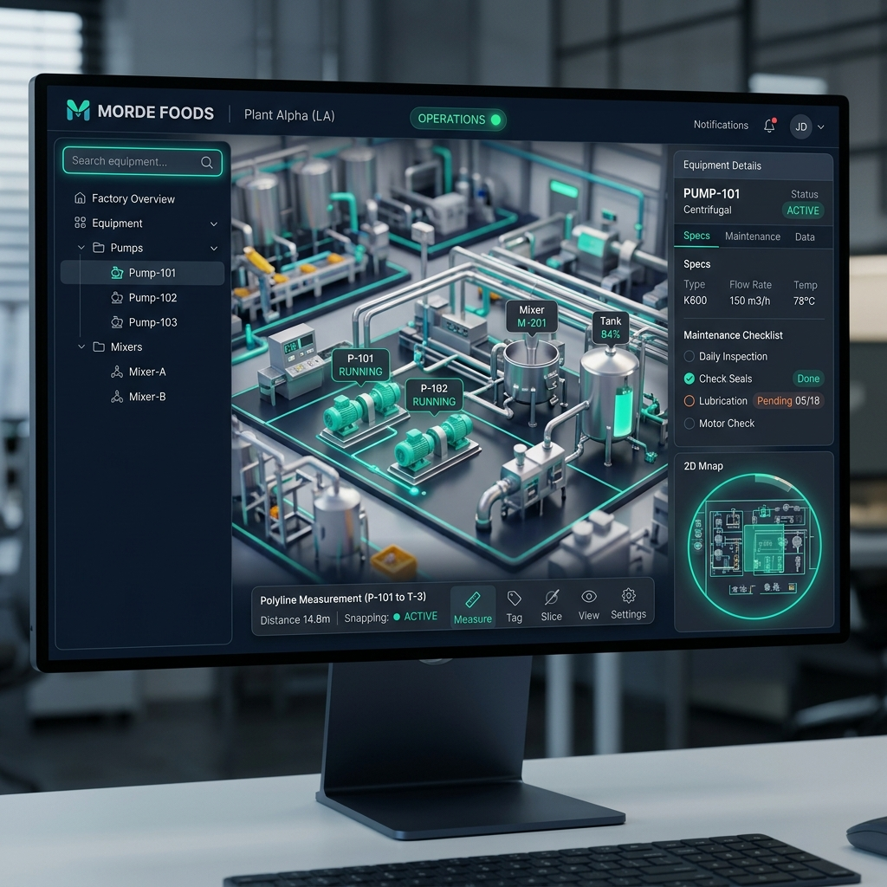

# Orion Studios — UI/UX Design System & Implementation Walkthrough
## Date: 2026-06-02 · Document ID: ORION-UI-UX-WALKTHROUGH

This document outlines the visual layout, structural widget tree, and step-by-step backend integration for the **Orion Modern Industrial Dashboard** user interface.

---

## 1. Visual Mockup & Design Aesthetics

Below is the high-fidelity concept mockup showing the **Modern Industrial Dashboard** visual theme. 



### Design Specifications `[trd.md §0.3]`
* **Style:** Sleek Glassmorphism — Translucent navy `#0A1628` and charcoal `#1A2332` panels with subtle glowing borders and backdrop blur.
* **Accent Indicators:** Glowing Teal `#00D4AA` for selected items and active states, Amber `#FFB74D` for warnings, and Red `#FF5252` for alarms.
* **Typography:** Clean, highly legible sans-serif (Inter/Roboto) sized dynamically.

---

## 2. Structural Widget Tree `[trd.md §5.1]`

To implement this interface, we must instantiate the root container widget `WBP_OrionRoot` which binds child components together in a clean, unified viewport overlay.

```
WBP_OrionRoot (User Widget — viewport overlay root, Z-Order: 0)
├── WBP_TopBar (Branded Client Header — Client Logo, Plant Name, Mode Indicator, Settings)
├── WBP_SidePanel (Left Collapsible Sidebar — 320px slide-out timeline)
│   ├── WBP_SearchBar (AutoComplete Input and virtualized flat result display)
│   └── WBP_TreeBrowser (Hierarchical Node Navigation: Buildings > Rooms > Equipment)
├── WBP_BottomBar (Live Status Panel — Snapping status, polyline length readouts)
├── WBP_Minimap (Top-Down Corner Overlay — Throttled Render Target + floor selector)
└── WBP_EquipmentDetails (Right Collapsible Slider — Overview, Components, Actions, Drawings, Data)
```

---

## 3. How the Backend & Widgets are Fully Wired

Here is the exact blueprint and C++ wiring diagram showing how each feature receives its raw data from the engine backend instead of being just a visual stub:

### A. The 2D Minimap System `[trd.md §2.3, §9.3, flow_diagrams.md §7]`
1. **Scene Capture Actor (`BP_MinimapCamera`):**
   * Spawns an orthographic camera (`USceneCaptureComponent2D`) suspended above the factory.
   * Captured texture output is mapped directly to a 512x512 Render Target texture asset (`RT_Minimap`).
   * **Performance Budget Throttling:** Throttled to render at **10fps** instead of every frame to conserve CPU/GPU time (under the `<1ms` GPU budget).
2. **Minimap Widget (`WBP_Minimap`):**
   * Uses an `Image` brush set to `RT_Minimap` as its background map.
   * Placed a rotating marker icon (`PlayerArrow`) representing the active player pawn, dynamically updating its Z-axis rotation based on the pawn's world heading.
3. **Minimap Click-to-Teleport:**
   * The user clicks a point on the widget. The widget converts the widget-space coordinates to normalized UV values.
   * Translates UV coordinates to world-space XY coordinates using the orthographic camera bounds:
     `World_X = CameraMin_X + U * (CameraMax_X - CameraMin_X)`
     `World_Y = CameraMin_Y + V * (CameraMax_Y - CameraMin_Y)`
   * Executes a line trace from `Max_Z` downward to find the walkable floor location.
   * Teleports the player pawn smoothly using `BP_CameraSweepManager`.

### B. Hierarchical Tree Browser `[trd.md §5.3]`
1. **Virtualized List Integration:**
   * To prevent memory bloat and UI lag with **6,500+ items** (which would freeze normal scroll boxes), `WBP_TreeBrowser` uses a virtualized `UListView` container.
   * In memory, it holds lightweight `UOrionTreeItemData` UObjects representing each level in the hierarchy (Building, Room, Equipment, Component).
2. **Flat-List Assembly:**
   * On initial load, it populates only the top-level nodes (Buildings) at depth `0`.
   * **Node Expansion:** When a user expands a building node, it queries `BP_HierarchyManager` for children, instantiates child elements at depth `1` (Rooms), and inserts them directly into the flat list array below the parent.
   * **Selection Delegate:** Clicking any equipment row triggers `OnEquipmentSelected.Broadcast(EquipmentID)` which fires camera sweeps and details panel transitions simultaneously!

### C. Search Auto-Complete System `[trd.md §3.2, §5.2]`
1. **C++ Fuzzy Search:**
   * User types into `WBP_SearchBar`. Every keystroke triggers `BP_HierarchyManager::SearchAll`.
   * **Fast Path:** Performs substring checks on Name, ProcessLine, and P&ID tags.
   * **Fuzzy Path:** Employs a C++ Levenshtein distance algorithm to find matches within a distance of 3 (e.g. "Mixr" matches "Mixer_01").
   * **Performance Caching:** Caches queries in a `TMap` lookup table to guarantee a `<200ms` search latency.
2. **UI Wrapping:**
   * Results are wrapped dynamically into flat `UOrionTreeItemData` objects and bound directly to a virtualized result list in the side drawer.

### D. Equipment Details Panel `[trd.md §4.1]`
1. **Overview & Spec Tables:**
   * Upon selection, `WBP_EquipmentDetails` queries `DT_Equipment` for the item's row.
   * Reads specifications from the row's `SpecsJSON` field, dynamically generating key-value rows inside the Overview panel.
2. **Dynamic 2D AutoCAD Drawing Viewer:**
   * Reads the `DrawingPaths` array from the data table row.
   * Instead of a static placeholder, it uses a **dynamic texture loader** to load high-resolution general arrangement drawings (exported as PNG format for runtime safety):
     `UTexture2D* LoadedDrawing = FImageUtils::ImportFileAsTexture2D(DrawingPath);`
   * Sets the loaded texture onto a pan-and-zoom scroll canvas in the Drawings tab!

---

## 4. Execution Plan to Build the UI/UX Assets

To implement this premium design system, we will now build the missing structural Blueprint assets and wire their graphs:

1. **Step 1:** Create `WBP_OrionRoot` container and lay out the slide-in drawers, header bar, and corner minimap slot.
2. **Step 2:** Create `WBP_TopBar` and bind its elements (logo path, company name) to our `OrionConfigSubsystem` config struct.
3. **Step 3:** Wire `WBP_Minimap` with the `RT_Minimap` render target texture, the rotation-updating player heading tracker, and the UV coordinate conversion viewport teleport function.
4. **Step 4:** Integrate `WBP_OrionRoot` directly into `BP_CollaborativeViewer_HUD` (subclassing the default template HUD) to automatically swap out the default template UI and load our stunning industrial layout.


---
## 🔗 Correlation Map
- **Dashboard:** [Home](../../Home.md)
- **Governing Specifications:** [PRD](../../GoverningDocuments/prd.md) · [TRD](../../GoverningDocuments/trd.md)
- **Implementation & Tasks:** [Plan](../decisions/implementation_plan.md) · [Tasks](task.md) · [Walkthrough](walkthrough.md) · [Session Log](session_log.md)
- **Active Agent System:** [Rules](../../.agents/rules/agents.md)
