# Orion Studios — System Flow Diagrams
**Version 1.0.0** · Orion Studios · 2026-05-31

---

## 1. Application Boot Flow

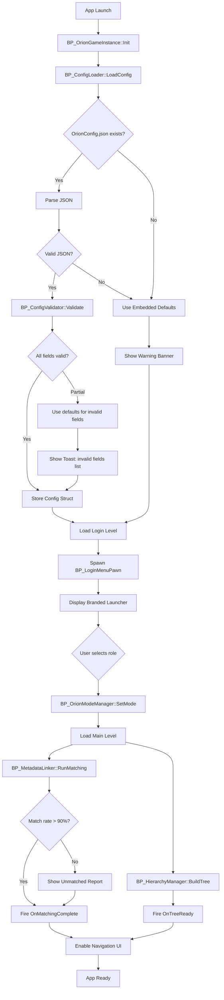

---

## 2. Mode Switching Flow

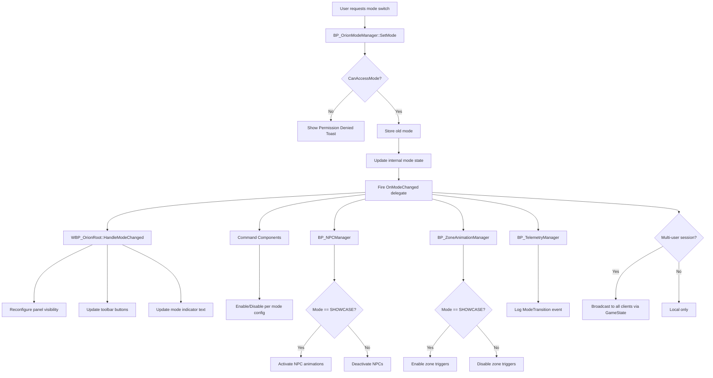

---

## 3. Equipment Selection Flow

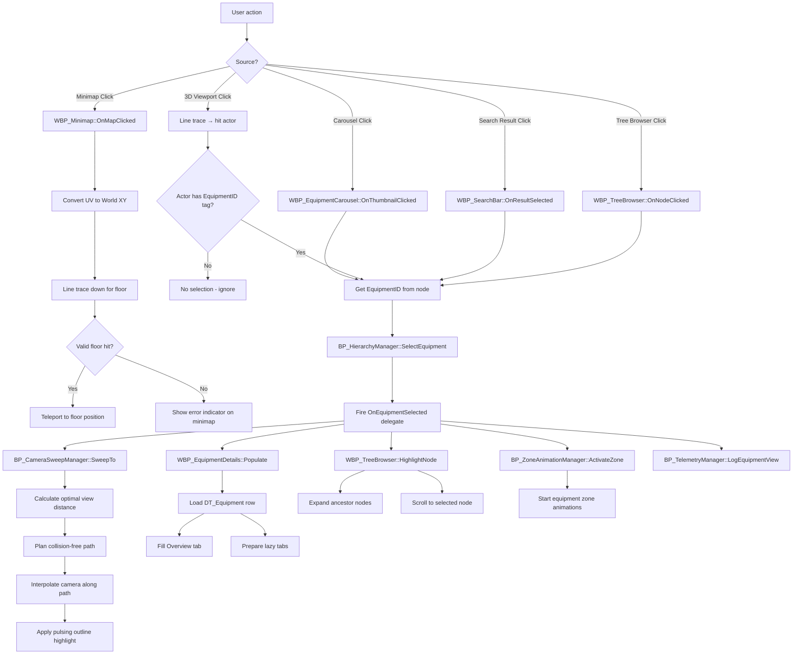

---

## 4. Guided Tour Flow

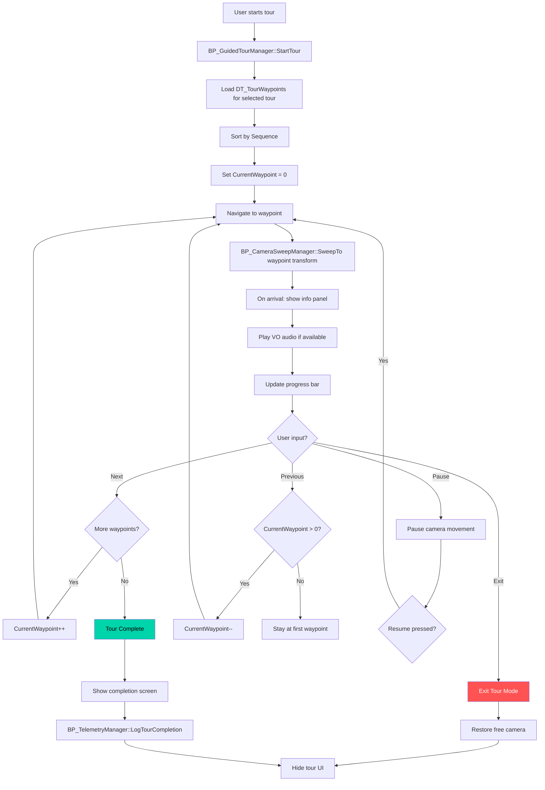

---

## 5. Measurement Tool Flow with Snap System

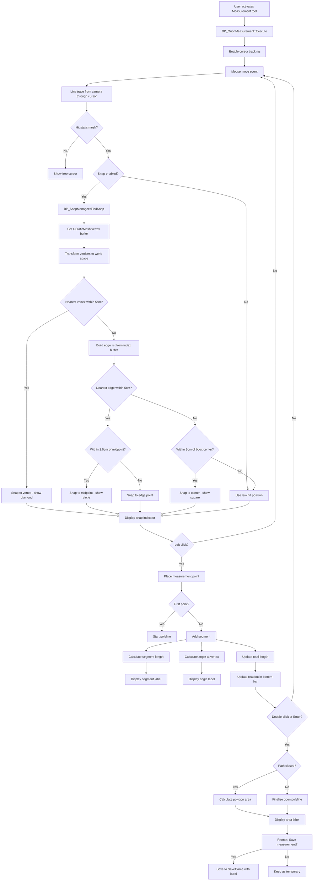

---

## 6. CropBox Section-Fill Flow

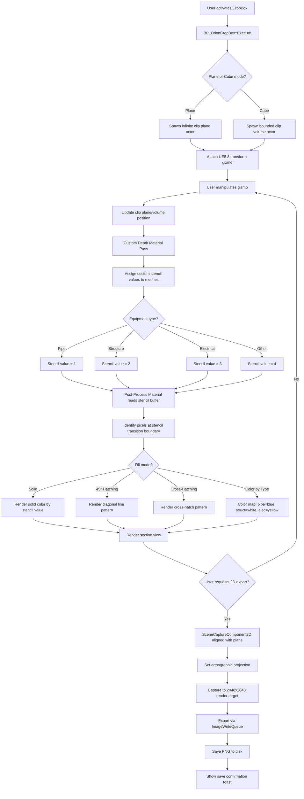

---

## 7. Minimap Click-to-Teleport Flow

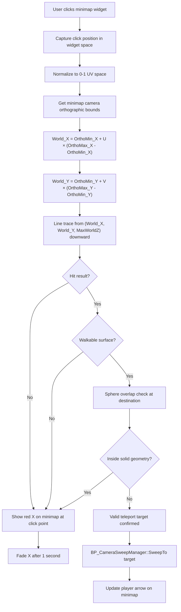

---

## 8. MetadataLinker Matching Flow

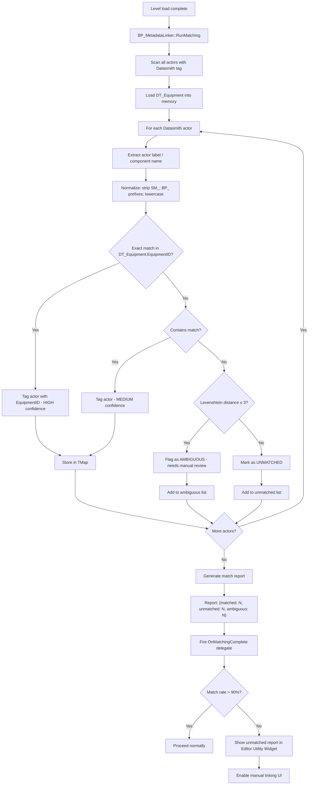

---

## 9. Multi-User Session Flow

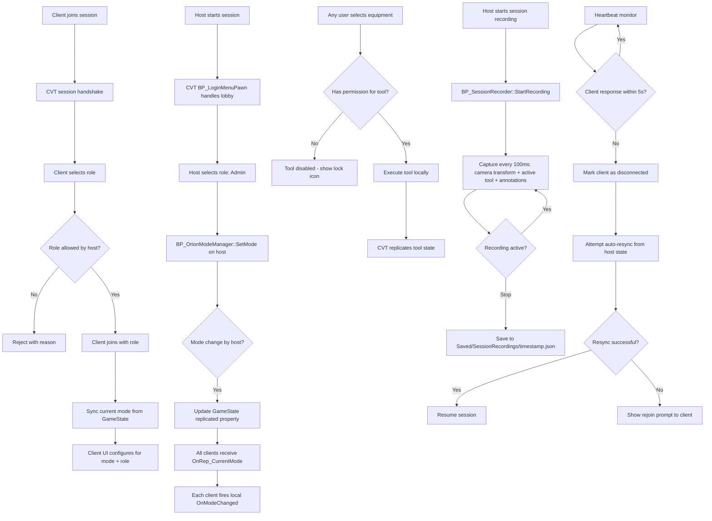

---

## 10. SaveGame Flow

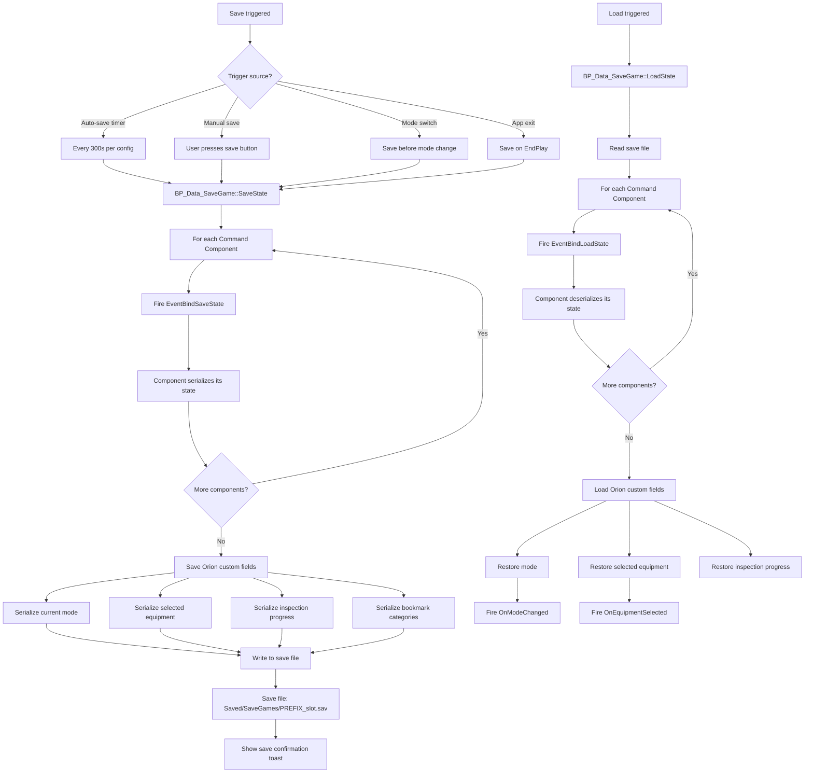

---

## 11. Config Validation & Hot-Reload Flow

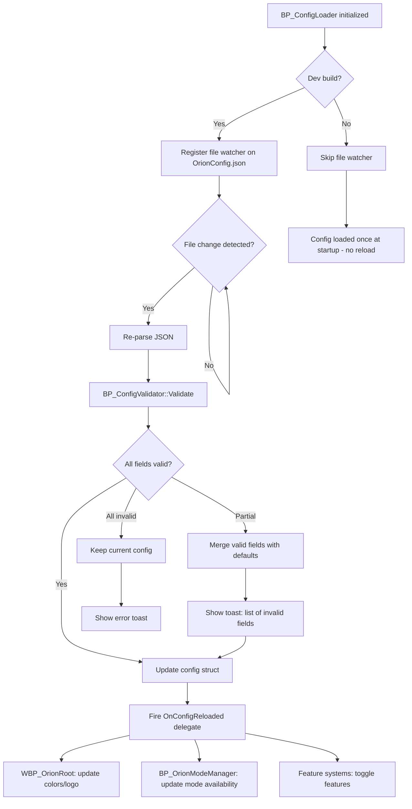

---

## 12. Content Pipeline Flow (Client Onboarding)

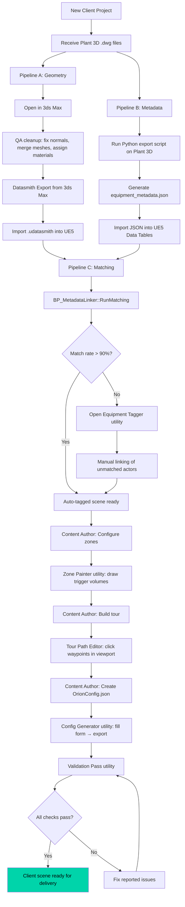
