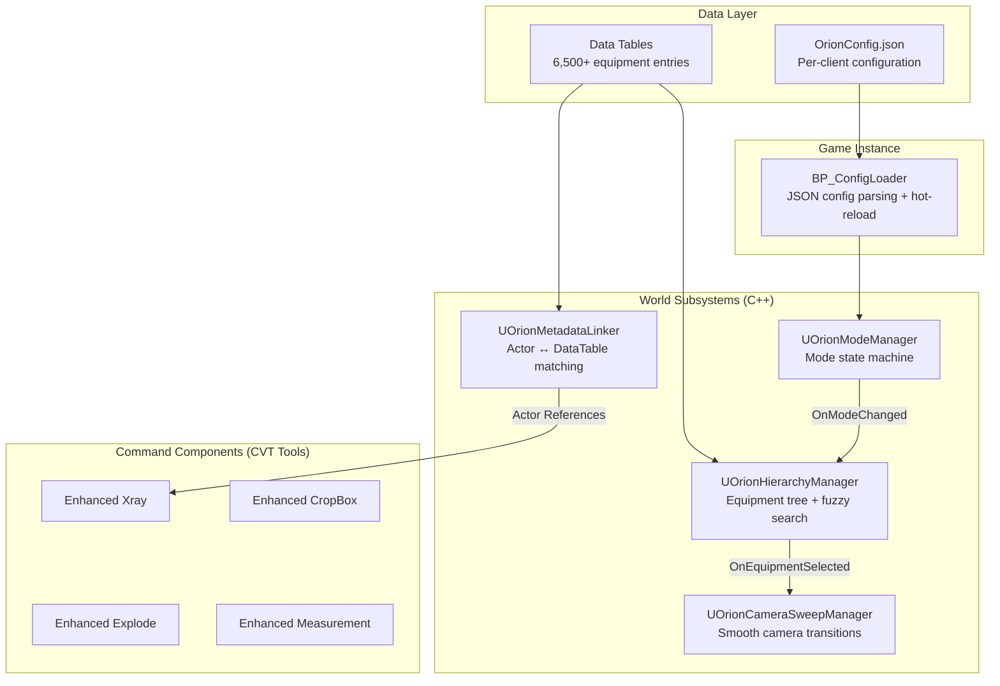
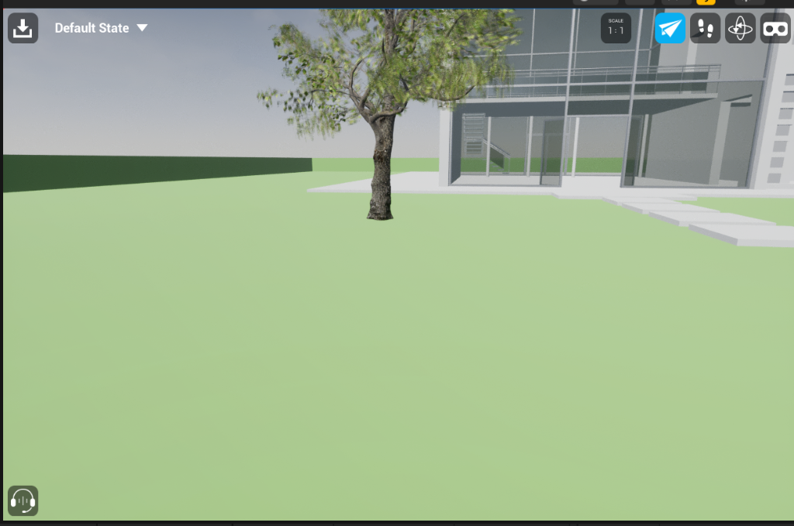

<div align="center">

# 🏭 Orion Studios — OrionCollab

### Industrial Plant Visualization Platform

**Transform AutoCAD Plant 3D models into interactive, photorealistic experiences**

[](https://www.unrealengine.com/)
[](https://isocpp.org/)
[](https://www.python.org/)
[](LICENSE)
[]()

<br/>


<br/>

*Operations Mode — Real-time equipment inspection with P&ID data, maintenance checklists, and 2D minimap navigation*

</div>

---

## The Problem

Industrial plants need to showcase facilities to investors, onboard employees, and support engineering inspections — without requiring physical access. Current solutions are:

- **Static renders/videos** — Non-interactive; can't answer questions on-the-fly
- **Generic VR walkthroughs** — Lack engineering data integration (P&ID, specs, process lines)
- **CAD viewers (Navisworks, BIM360)** — Powerful but ugly, slow, and intimidating for non-technical stakeholders

## The Solution

**Orion Studios** is a reusable Unreal Engine 5.8 platform that transforms AutoCAD Plant 3D exports into an interactive, photorealistic industrial visualization application — serving three distinct audiences from a single codebase.

### Key Differentiators

| Feature | Description |
|---------|-------------|
| 🔄 **Dual-Import Pipeline** | Geometry from 3ds Max + metadata from Plant 3D Python script, auto-matched by tag |
| 🎭 **Mode-Based Access** | Role-based launcher routes users to Showcase (investors) or Operations (engineers) |
| 🏗️ **Client-Swappable** | Per-client JSON config changes branding, features, and plant data — zero code changes |
| 👥 **Multi-User Collaboration** | Built-in collaborative sessions with role-based permissions |
| 🖥️ **Desktop + PC VR** | Single codebase targets both desktop and tethered VR experiences |

---

## ✨ Features

### Mode A — Showcase (Investors & Visitors)

| Feature | Description |
|---------|-------------|
| 🎬 Guided Tour | Scripted camera path with info panels, Play/Pause/Next controls, and progress bar |
| 🌳 Hierarchy Browser | Collapsible tree: Buildings → Rooms → Equipment (virtualized for 6,500+ entries) |
| 🔍 Fuzzy Search | Search by P&ID tag, equipment name, or process line with <200ms latency |
| 📸 Snapshot Tool | Capture and save views with timestamps |
| 🏃 NPC Workers | Zone-based animated NPCs that bring the plant to life |
| 🚪 Interactive Doors | Auto-open on approach for immersive walkthroughs |
| ⚙️ Equipment Animations | Conveyor belts, mixers, and process equipment with zone-based activation |
| 💡 Photorealistic Rendering | Lumen GI, HDRI sky, and premium post-process effects |

### Mode C — Operations (Engineers)

| Feature | Description |
|---------|-------------|
| 📋 Equipment Details Panel | Tabbed interface: Overview, Components, Actions, Drawings, Data |
| 🔬 Enhanced X-Ray | Global or per-equipment transparency, color-coded by system type |
| 💥 Hierarchical Explode | 3-level explosion (assemblies → sub-components → parts) with distance slider |
| ✂️ Section Cut | Clipping planes with engineering-style hatching and PNG export |
| 📏 Polyline Measurement | Multi-point distances with AutoCAD-style snapping and unit switching |
| 🗺️ 2D Minimap | Overhead view with position indicator, click-to-teleport, and floor selector |
| 🔧 Maintenance Overlay | Callouts showing part status, last service date, and maintenance intervals |
| 📐 P&ID Integration | Click hotspots to open P&ID documents; trace process line paths with flow animation |

---

## 🏗️ Architecture



### Module Classification

| Type | Lifecycle | Examples |
|------|-----------|----------|
| **World Subsystem** (C++) | Per-level, destroyed on unload | ModeManager, HierarchyManager, MetadataLinker, CameraSweep |
| **Command Component** (BP) | CVT lifecycle: `Bind → Execute → Disabled` | Xray, Explode, CropBox, Measurement, Snapshot |
| **Level Actor** (BP) | Placed/spawned at runtime | TourManager, NPCManager, ZoneAnimationManager |
| **Game Instance** (BP) | Persists across levels | ConfigLoader |

> 📖 Full architecture docs: [`docs/architecture/system-overview.md`](docs/architecture/system-overview.md)

---

## 🔧 Tech Stack

| Layer | Technology |
|-------|-----------|
| Engine | Unreal Engine 5.8 |
| Template | CollabViewer Template (CVT) |
| Language | Blueprint + C++ (performance-critical subsystems) |
| Rendering | Lumen (desktop) / Baked (VR) |
| UI | UMG with glassmorphism materials |
| Data | UE5 Data Tables + JSON config |
| Networking | CVT multi-user sessions |
| VR | OpenXR (SteamVR / Meta Quest Link) |
| CAD Pipeline | Datasmith (3ds Max exporter) |
| Metadata | Python 3.x automation scripts |

---

## 📁 Project Structure

```
OrionCollab/
├── Config/                     # UE5 engine & project configuration
├── Content/                    # All UE5 assets
│   ├── ArchVis/               # Architecture visualization sample content
│   └── CollaborativeViewer/   # CVT template + Orion extensions
│       ├── Blueprints/        # Game logic, subsystems, tools
│       ├── Data/              # Data Tables (equipment, buildings, rooms)
│       ├── Maps/              # Level maps
│       └── UMG/               # UI widgets, textures, materials
├── Source/OrionCollab/         # C++ source code
│   ├── OrionHierarchyManager  # Equipment tree + fuzzy search
│   ├── OrionMetadataLinker    # Datasmith actor ↔ DataTable matching
│   ├── OrionModeManager       # Mode state machine + role access
│   ├── OrionConfigSubsystem   # JSON config loading + validation
│   └── OrionCameraSweepManager # Spline-based camera transitions
├── Scripts/                    # Python tooling
│   ├── automation/            # Pipeline: metadata export & import
│   ├── setup/                 # Editor subsystem setup scripts
│   ├── tests/                 # Automated test suite
│   └── config/                # OrionConfig.json
├── GoverningDocuments/         # Specifications (PRD, TRD, schemas)
├── docs/                       # Portfolio documentation
│   ├── architecture/          # System overview, flow diagrams
│   ├── design/                # UI system, tree browser, config loader
│   ├── setup/                 # Getting started, pipeline, configuration
│   ├── api/                   # Backend schema reference
│   ├── demos/                 # Interactive HTML UI/UX demos
│   └── media/                 # Screenshots and mockups
├── UnrealMCP/                  # MCP bridge for AI-assisted development
├── .notes/                     # Design patterns & session logs
├── README.md
├── LICENSE                     # MIT
├── CONTRIBUTING.md
└── CHANGELOG.md
```

---

## 🚀 Getting Started

### Prerequisites

- **Unreal Engine 5.8** (via Epic Games Launcher)
- **Visual Studio 2022+** with "Game development with C++" workload
- **Python 3.10+** (for automation scripts)
- **Git** with LFS support

### Setup

```bash
# Clone
git clone https://github.com/OrionStudio07/OrionCollab.git
cd OrionCollab

# Open in Unreal Engine
# Double-click OrionCollab.uproject
# Wait for shaders to compile (~10-15 min on first launch)

# Verify configuration
# Check Scripts/config/OrionConfig.json exists
# Press Alt+P to Play in Editor
```

> 📖 Detailed setup: [`docs/setup/getting-started.md`](docs/setup/getting-started.md)

---

## 🔄 Content Pipeline

```
AutoCAD Plant 3D ──┬──→ 3ds Max ──→ Datasmith ──→ UE5 Scene Actors ──┐
                   │                                                   ├──→ MetadataLinker ──→ Tagged Equipment
                   └──→ Python Script ──→ JSON ──→ Data Tables ───────┘
                                                                    (>90% auto-match rate)
```

Three parallel pipelines transform CAD data into interactive 3D experiences:
- **Pipeline A (Geometry)**: Plant 3D → 3ds Max cleanup → Datasmith import
- **Pipeline B (Metadata)**: Plant 3D → Python export → JSON → Data Tables
- **Pipeline C (Matching)**: MetadataLinker auto-matches actors to metadata by tag

> 📖 Full pipeline docs: [`docs/setup/content-pipeline.md`](docs/setup/content-pipeline.md)

---

## ⚙️ Configuration

Each client deployment is configured via a single JSON file — no code changes required:

```json
{
  "client": {
    "company_name": "Morde Foods",
    "plant_name": "P2 Manufacturing Plant",
    "accent_color": "#00D4AA"
  },
  "modes": { "showcase": true, "operations": true },
  "features": { "minimap": true, "guided_tour": true },
  "optimization": { "lumen_enabled": true, "target_fps_desktop": 60 }
}
```

> 📖 Full config reference: [`docs/setup/configuration.md`](docs/setup/configuration.md)

---

## 📊 Performance Targets

| Metric | Target |
|--------|--------|
| Desktop FPS | ≥60 fps |
| VR FPS | ≥72 fps |
| Level load (6,500 actors) | <30 seconds |
| Search latency | <200ms |
| Tree browser scroll | 60fps (virtualized, 6,500 entries) |
| MetadataLinker match rate | >90% |

---

## 📸 Gallery

<div align="center">

| Operations Mode Mockup | Viewport |
|:---:|:---:|
|  |  |

</div>

---

## 📖 Documentation

| Document | Description |
|----------|-------------|
| [System Architecture](docs/architecture/system-overview.md) | Module architecture, data flow, Mermaid diagrams |
| [Flow Diagrams](docs/architecture/flow-diagrams.md) | Boot, mode transition, search, and matching sequences |
| [UI Design System](docs/design/ui-system.md) | Glassmorphism, mode-based visibility, transitions |
| [Tree Browser](docs/design/tree-browser.md) | Virtualized list rendering for 6,500+ entries |
| [Config Loader](docs/design/config-loader.md) | JSON loading, validation, hot-reload |
| [Getting Started](docs/setup/getting-started.md) | Prerequisites, setup, first run |
| [Content Pipeline](docs/setup/content-pipeline.md) | Plant 3D → UE5 workflow |
| [Configuration](docs/setup/configuration.md) | OrionConfig.json reference |
| [Backend Schema](docs/api/backend-schema.md) | Data Table schemas, enums |
| [Product Requirements](GoverningDocuments/prd.md) | User stories, acceptance criteria |
| [Technical Reference](GoverningDocuments/trd.md) | Full API specifications |

---

## 🧪 Testing

```bash
python Scripts/tests/test_config_subsystem.py    # Config loading & validation
python Scripts/tests/test_hierarchy_manager.py    # Equipment tree & search
python Scripts/tests/test_metadata_linker.py      # Actor matching accuracy
python Scripts/tests/test_mode_manager.py         # Mode transitions & permissions
python Scripts/tests/test_camera_sweep.py         # Camera animation
python Scripts/tests/test_minimap_logic.py        # Minimap teleport
python Scripts/tests/test_search_ui.py            # Search latency & results
```

> Tests require the Unreal Editor running with the project open and MCP bridge active.

---

## 📋 Reference Data

Built and tested against the **Morde Foods P2 Manufacturing Plant**:
- 6,500 equipment tags
- 1,394 instrumentation points
- ~500 process lines
- ~200 unique equipment items

---

## 👥 Team

| | Role |
|---|---|
| **Sho** | Lead Developer — Architecture, C++ subsystems, AI-assisted workflow |
| **Rohit** | Content Author — Scene setup, material authoring, plant data |

---

## 📄 License

This project is licensed under the [MIT License](LICENSE).

---

## 🤝 Contributing

See [CONTRIBUTING.md](CONTRIBUTING.md) for guidelines on branch naming, commit conventions, and pull request process.
