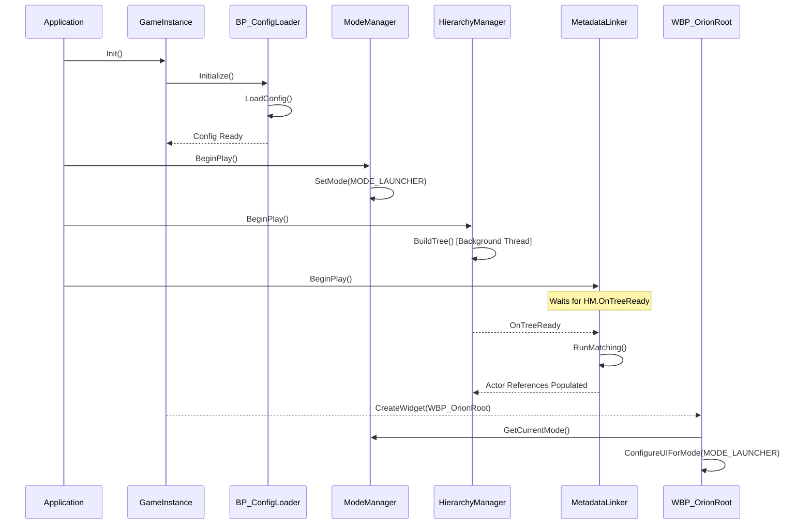
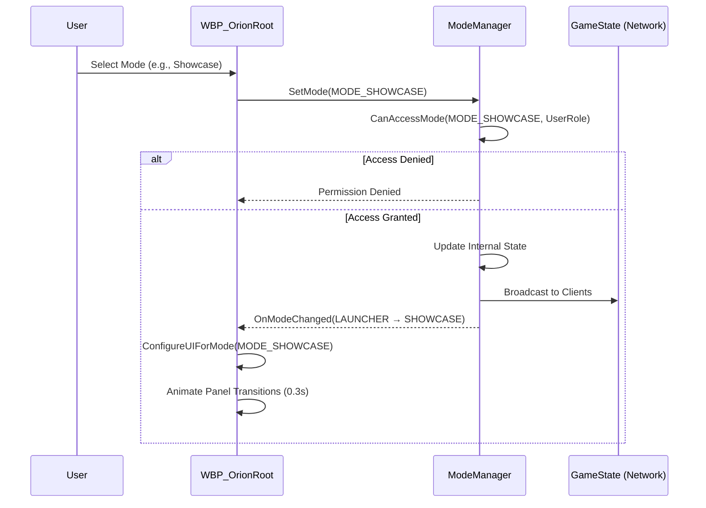
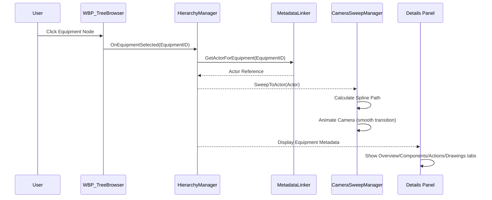
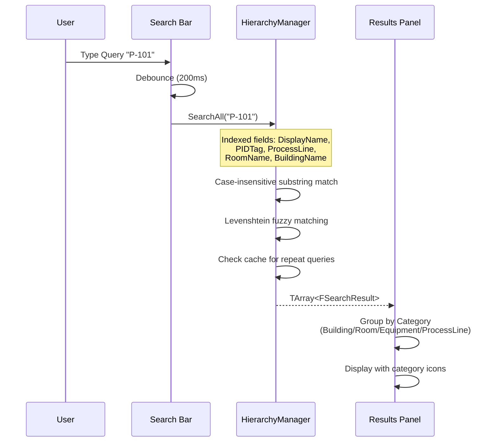
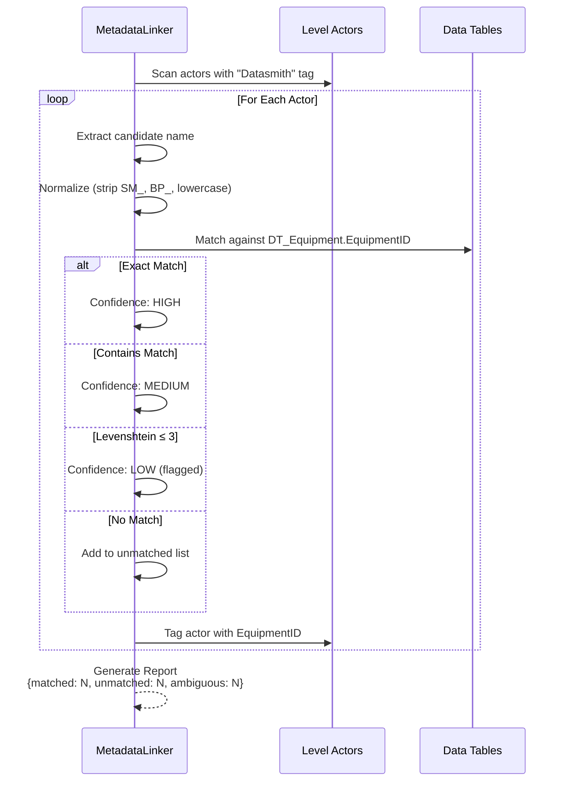

# Flow Diagrams

> Canonical event sequences for all major features. See the full specification in [flow_diagrams.md](../../GoverningDocuments/flow_diagrams.md).

---

## Application Boot Flow

---

## Mode Transition Flow

---

## Equipment Selection Flow

---

## Search Flow

---

## MetadataLinker Matching Flow

