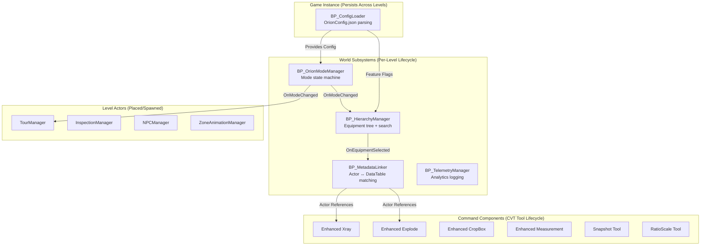
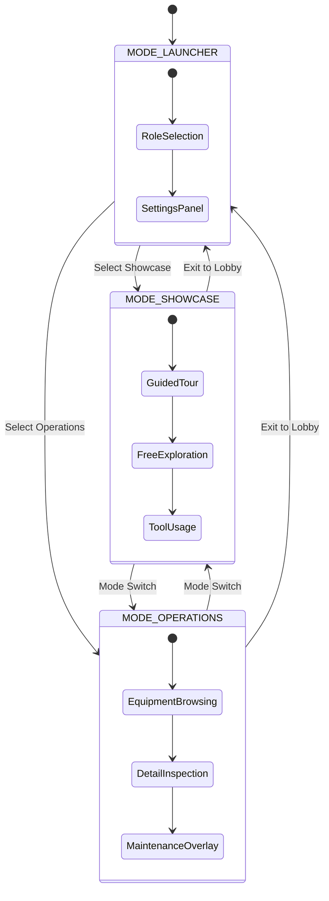
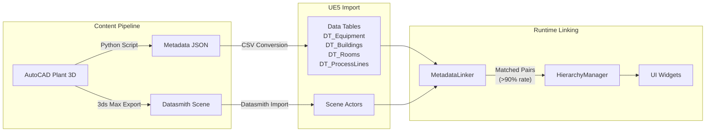

# System Architecture Overview

> Derived from the [Technical Reference Document](../../GoverningDocuments/trd.md)

---

## Engine & Technology Stack

| Layer | Technology | Version | Purpose |
|-------|-----------|---------|---------|
| Engine | Unreal Engine | 5.8 | Runtime, editor, packaging |
| Template | CollabViewer Template (CVT) | UE5.8 bundled | Multi-user, tools, pawn hierarchy |
| Rendering | Lumen (desktop) / Baked (VR) | Native | GI, reflections |
| UI | UMG (Unreal Motion Graphics) | Native | All in-game UI widgets |
| Data | UE5 Data Tables + JSON config | Native | Equipment metadata, tour waypoints, NPC defs |
| Networking | CVT session system | Native | Multi-user collaboration |
| VR | OpenXR via SteamVR / Meta Quest Link | Native | PC tethered VR |
| CAD Pipeline | Datasmith (3ds Max exporter) | UE5.8 bundled | Geometry import |
| Metadata | Python 3.x (Plant 3D script) | External | Tag/metadata export |

---

## Module Architecture

Modules are classified into four types based on lifecycle and communication pattern:

### Module Classification

| Type | UE5 Class | Lifecycle | Examples |
|------|-----------|-----------|----------|
| **World Subsystem** | `UWorldSubsystem` | Created per-world; destroyed on level unload | ModeManager, HierarchyManager, MetadataLinker, TelemetryManager |
| **Command Component** | `BP_BaseCommandComponent` child | Follows CVT lifecycle: `Bind_Options → Execute → Disabled` | Xray, Explode, CropBox, Measurement, Snapshot, RatioScale |
| **Actor** | `AActor` | Placed in level or spawned at runtime | TourManager, InspectionManager, NPCManager |
| **Game Instance** | `UGameInstance` child | Persists across level loads | ConfigLoader |

---

## Mode System

The application operates in distinct modes, each targeting a different user persona:

| Mode | Enum Value | Default Pawn | Target Persona |
|------|-----------|--------------|----------------|
| `MODE_LAUNCHER` | 0 | BP_LoginMenuPawn | All users |
| `MODE_SHOWCASE` | 1 | OrbitMode (switchable) | Visitors / Investors |
| `MODE_OPERATIONS` | 2 | WalkMode (switchable) | Plant Engineers |
| `MODE_TRAINING` | 3 | Reserved for v2 | Trainees |

---

## Data Flow

---

## C++ Subsystem Layer

The following modules are implemented in C++ for performance-critical operations:

| Module | Header | Purpose | Key API |
|--------|--------|---------|---------|
| `UOrionHierarchyManager` | `OrionHierarchyManager.h` | Equipment tree building + fuzzy search | `BuildTree()`, `SearchAll()`, `GetEquipmentByRoom()` |
| `UOrionMetadataLinker` | `OrionMetadataLinker.h` | Datasmith actor ↔ DataTable matching | `RunMatching()`, `GetActorForEquipment()` |
| `UOrionModeManager` | `OrionModeManager.h` | Mode state machine + role permissions | `SetMode()`, `CanAccessMode()` |
| `UOrionConfigSubsystem` | `OrionConfigSubsystem.h` | JSON config loading + validation | `LoadConfig()`, `GetConfig()` |
| `UOrionCameraSweepManager` | `OrionCameraSweepManager.h` | Smooth camera transitions | `SweepToLocation()`, `SweepToActor()` |

---

## Performance Budgets

| Metric | Budget | Source |
|--------|--------|--------|
| Desktop FPS | ≥60 fps | Release gate |
| VR FPS | ≥72 fps | Release gate |
| Level load time | <30 seconds (6500 actors) | Release gate |
| Search latency | <200ms any query | HierarchyManager spec |
| Tree browser scroll | 60fps with 6500 entries | Virtualized ListView |
| MetadataLinker match rate | >90% of Datasmith actors | Release gate |
