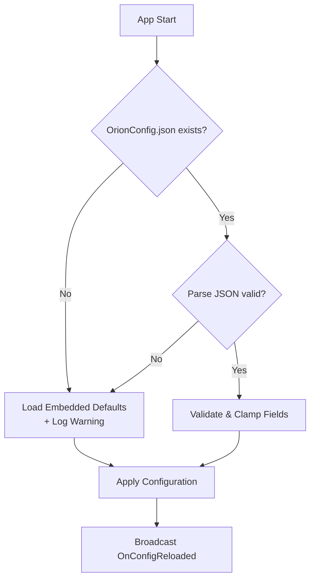

# Configuration Loader

> Derived from [BP_ConfigLoader_Logic](../../.notes/patterns/BP_ConfigLoader_Logic.md)

---

## Overview

`BP_ConfigLoader` handles loading, parsing, and validating the per-client `OrionConfig.json` file at application startup. It provides graceful fallback to embedded defaults on missing or malformed files, and supports hot-reload during development.

---

## Load Flow

## Validation Rules

| Field | Validation | Fallback |
|-------|-----------|----------|
| `client.company_name` | Non-empty string | `"Orion Studios"` |
| `client.plant_name` | Non-empty string | `"Demo Plant"` |
| `client.accent_color` | Hex format `#RRGGBB` | `#00D4AA` |
| `optimization.target_fps_desktop` | Clamped 30–144 | `60` |
| `optimization.target_fps_vr` | Clamped 30–144 | `72` |
| `optimization.vr_mode` | `"pc_tethered"` or `"disabled"` | `"pc_tethered"` |
| `save_game.auto_save_interval_seconds` | Clamped 60–3600 | `300` |
| `save_game.save_file_prefix` | Non-empty string | `"Orion"` |

## Hot-Reload (Development Only)

In `WITH_EDITOR` builds, `BP_ConfigLoader` registers a file watcher on `OrionConfig.json`. On modification:
1. Calls `LoadConfig()` to re-parse
2. Broadcasts `OnConfigReloaded` delegate
3. Subscribed widgets refresh branding, colors, and feature flags instantly
