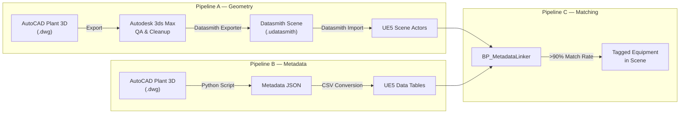

# Content Pipeline

> How AutoCAD Plant 3D models become interactive 3D experiences in Orion Studios.

---

## Pipeline Overview



---

## Pipeline A: Geometry Import

### Step 1: Export from Plant 3D
- Export the plant model as `.dwg` or `.fbx` from AutoCAD Plant 3D
- Ensure P&ID tags are preserved as component names

### Step 2: 3ds Max QA
- Import into 3ds Max for geometry cleanup
- Fix normals, reduce polygon count on non-hero assets
- Organize by building/floor hierarchy
- Install the Datasmith Exporter plugin for 3ds Max

### Step 3: Datasmith Import to UE5
- Use Datasmith Importer in UE5 to bring in the scene
- Preserves hierarchy, materials, and transforms
- Actors retain their original names for metadata matching

---

## Pipeline B: Metadata Export

### Step 1: Run the Python Export Script
```bash
python Scripts/automation/export_plant3d_metadata.py
```
Extracts equipment tags, process lines, specifications, and hierarchical relationships from Plant 3D.

### Step 2: Convert to Data Table Format
```bash
python Scripts/automation/convert_metadata_to_csv.py
```
Transforms the JSON output into CSV files compatible with UE5 Data Tables:
- `DT_Equipment` — Equipment specs, P&ID tags, process lines
- `DT_Buildings` — Building definitions
- `DT_Rooms` — Room classifications and safety zones
- `DT_ProcessLines` — Process line routing

### Step 3: Import into UE5
```bash
python Scripts/automation/import_data_tables.py
```
Imports the CSV data into UE5 Data Tables via the editor scripting API.

---

## Pipeline C: Actor-Metadata Matching

`BP_MetadataLinker` runs automatically on level load and matches Datasmith-imported actors to Data Table rows:

1. Scan all actors with the "Datasmith" tag
2. Normalize names (strip `SM_`, `BP_` prefixes, lowercase)
3. Match against `DT_Equipment.EquipmentID`:
   - **Exact match** → highest confidence
   - **Contains match** → medium confidence
   - **Levenshtein ≤ 3** → low confidence (flagged as ambiguous)
4. Tag matched actors with their `EquipmentID`
5. Generate match report: `{matched: N, unmatched: N, ambiguous: N}`

**Target**: >90% automatic match rate for production scenes.
